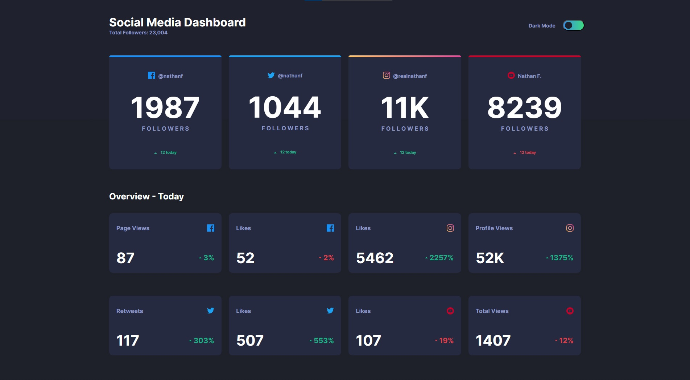

# Frontend Mentor - Social media dashboard with theme switcher solution

This is a solution to the [Social media dashboard with theme switcher challenge on Frontend Mentor](https://www.frontendmentor.io/challenges/social-media-dashboard-with-theme-switcher-6oY8ozp_H).

## Table of contents

- [Overview](#overview)
  - [The challenge](#the-challenge)
  - [Screenshot](#screenshot)
  - [Links](#links)
- [My process](#my-process)
  - [Built with](#built-with)
  - [What I learned](#what-i-learned)
  - [Continued development](#continued-development)
- [Author](#author)


## Overview

### The challenge

Users should be able to:

- View the optimal layout for the site depending on their device's screen size
- See hover states for all interactive elements on the page
- Toggle color theme to their preference

### Screenshot




### Links

- Live Site URL: [Add live site URL here](https://your-live-site-url.com)

## My process

### Built with

- Semantic HTML5 markup
- CSS custom properties
- Flexbox
- CSS Grid
- Javascript


### What I learned

How do I create a simple theme switcher using HTML, CSS, and JS?

Answer: You can add a click event listener to a button, toggle a CSS class on the desired elements using JavaScript, and update the text/content accordingly.

how to amke theme switcher
make ::root, --primary-color and then use var(--primary-color) to set
and in JS change the vars in root


how to limit number of columns in flex
Answer: You can use the flex-wrap property with a max-width on the container to limit the number of columns. Set flex-wrap: wrap on the container and adjust the max-width to your desired value.


when not wanting background to repeat again
background-repeat: no-repeat;
  background-size: cover;

filter: brightness(1.3);
for if not need opacity

One of my greatest obstacles in solving this challenge is figuring out how to create a theme switcher.
I resolved the problem by creating a root selector and naming the properties that are supposed to switch in color such as the background color, the top background, the text, and etc.
```css
:root {
  --background-color: hsl(230, 17%, 14%);
  --topbackground-color: hsl(232, 19%, 15%);
  --card-background: hsl(228, 28%, 20%);
  --primary-text: hsl(228, 34%, 66%);
  --secondary-text: hsl(0, 0%, 100%);
  --lime-green: hsl(163, 72%, 41%);
  --bright-red: hsl(356, 69%, 56%);
  --button-background: linear-gradient(to right,hsl(210, 78%, 56%), hsl(146, 68%, 55%));
}
```

The other obstacle I faced is not understanding to myself how to limit the number of columns there should be in one flex row. After a while I figured out that I can just set the width of the flex items to a certain percentage and give them the property of flex:1.

```css
.overview-card-div{
  flex: 1 0 20%;
}
```

Another lesson I've learned is when I encountered a problem wherein the background color repeats itself when scrolling down. I wanted the body to not extend and be by itself. I then researched for a bit and found certain properties I wasn't aware of

```css
body{
  background-repeat: no-repeat;
  background-size: cover;
}
```

I usually use opacity when hovering over items but in this situation I found the filter property to work well.

```css
.anything{
  filter: brightness(1.1);
}
```

### Continued development

When in light mode, since I used the brightness filter I have yet to find an easy and convenient solution to make the cards darker on hover rather than lighter. I already know of workarounds to this however it's with creating another div below the container and might not be the best solution. I left it be for now since it doesn't look as bad.

Something I haven't been good at is learning about how to make a webpage very responsive and so the future development of my projects I will try to incorporate responsive web design to a better scale.

There are many mobile users and I will learn to create webpages that cater to them.

## Author

- Website - [John Leomarc Alonzo](https://alonzo0812.github.io/socmed-dashboard/)
- Frontend Mentor - [@alonzo0812](https://www.frontendmentor.io/profile/alonzo0812)


